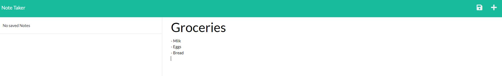

## Note Taker

## Description

This application uses an Express.js back end to save and retrieve note data from a JSON file. The application can be used to write and save notes.

## Table of Contents

1. [Installation](#Installation)
2. [Usage](#Usage)
3. [Technologies](#Technologies)
4. [Contributing](#Contributing)
5. [Questions](#Questions)

## Installation

No installation is required. Follow this [link](https://afternoon-mountain-01224.herokuapp.com/) to begin using the note taker app.

## Usage

Open the note taker application, and enter a new note title and text. Use the save icon in the navigation at the top of the page to save your note.

The saved note will then appear in the left-hand column.

Notes can be removed when no longer required using the delete icon.

## Technologies

- HTML
- CSS
- JavaScript
- FS
- Express
- UUID

  ## Contributing

  If you would like to contribute to this project, feel free to create a branch and contribute as you like. Packages required are FS, Express, and UUID. Any additions will be reviewed before being implemented.

  ## Questions

  If you have any questions, or additional feedback, please feel free to reach out on my
  [GitHub Account](https://github.com/AshWeston) or send me an email at ash-w@live.com.au.
